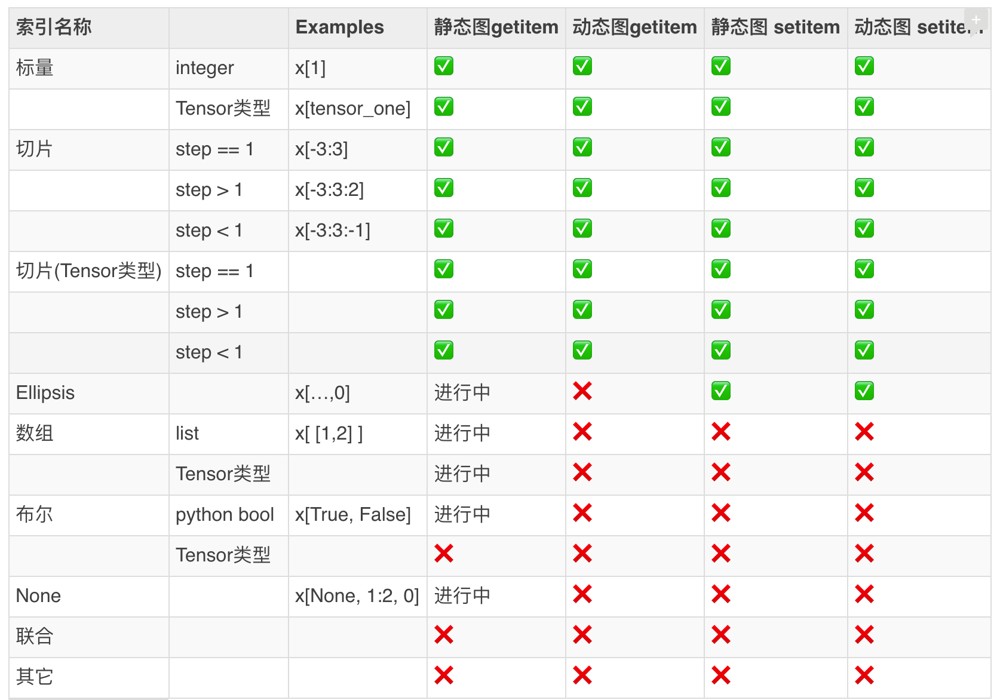

# 调试经验


## 一、错误日志怎么看

**如下是一个报错栈输出样例：**

)

**动转静的报错栈，自顶向下总共包含4个核心部分：**

+ 原生 Python 的报错栈（对应上图 ①）
>  此行所在代码为出错的用户最顶层代码入口，如上图 ① 意味着是 `paddle.jit.save()` 这样调用导致的后续一系列报错。

+ 动转静报错栈起始标志位（对应 ②）
> 实际场景中，可以直接搜索 `transformed code` 关键字，并从这一行以下开始看报错日志即可。

+ 实际出错的转写代码位置（对应 ③）
> 表示具体执行到哪一行转写代码时报的错误，对应的是转写后的代码行。如上图 ② 中执行到 `paddle.stack` 处报的错误。

+ 静态图相关的框架层面报错信息（对应 ④）
> 此部分与静态图组网报错信息是一致的。一般可以直接根据最后三行的信息，定位具体是在生成哪个 OpDesc 时报的错误，一般是与执行此 Op 的 infershape 逻辑报的错误。


## 二、快速确定问题原因

经过汇总整理，根据报错信息的种类，可以将动转静的问题大致分为如下几个类别：

### 2.1 (NotFound) Input("X")

**报错信息大致如下：**

```bash
RuntimeError: (NotFound) Input("Filter") of ConvOp should not be null.
  [Hint: Expected ctx->HasInputs("Filter") == true, but received ctx->HasInputs("Filter"):0 != true:1.] 
  [operator < conv2d > error]
```

此类问题的原因一般是：

> 执行到报错所在行的 Paddle API 时，某些输入或者 weight 的类型还是动态图的 Tensor，而非静态图的 Variable 或者 Parameter.

**排查建议：**

+ 首先确认代码所在的 sublayer 是否继承了 `nn.Layer`
+ 此行代码所在函数是否绕开了 foward 函数，单独调用的（2.1 版本之前）
+ 如何查看是 Tensor 还是 Vaiable 类型，可以通过 pdb 交互式调试


### 2.2 Expected input_dims[i] == input_dims[0]

**报错信息大致如下：**

```bash
[Hint: Expected input_dims[i] == input_dims[0], but received input_dims[i]:-1, -1 != input_dims[0]:16, -1.] 
  [operator < xxx_op > error]
```

此类问题的原因一般是：
> 逐个 append_op 生成静态图 Program 时，在执行到某个 Paddle API 时，编译期 infershape 不符合要求。

**排查建议：**

+ 代码层面，判断是否是上游使用了`reshape`导致 -1 的污染性传播
> 动态图由于执行时 shape 都是已知的，所以 reshape(x, [-1, 0, 128]) 是没有问题的。但静态图组网时都是编译期的 shape（可能为-1），因此使用 reshape 接口时，尽量减少 -1 的使用。

+ 可以结合后续调试技巧，判断是否是某个 API 的输出 shape 在动静态图下有 diff 行为
> 比如某些 Paddle API 动态图下返回的是 1-D Tensor， 但静态图却是始终和输入保持一致，如 `ctx->SetOutputDim("Out", ctx->GetInputDim("X"));`

### 2.3 desc->CheckGuards() == true

```bash
[Hint: Expected desc->CheckGuards() == true, but received desc->CheckGuards():0 != true: 1.] 
```

此类问题的原因一般是：
> 模型代码中存在一些高阶的 Tensor slice 赋值操作。一些静态图高阶的 slice 语法功能正在与动态图对齐和支持中。

**如下是当前动、静态图对 slice 语法功能的汇总情况：**



**排查建议：**

+  模型代码是否存在上述复杂的 Tensor slice 切片操作
+ 推荐使用 paddle.slice 接口替换复杂的 Tensor slice 操作

### 2.4 Segment Fault
当动转静出现 **段错误** 时，报错栈信息也会很少，但导致此类问题的原因一般也比较明确。

此类问题的一般原因是：

> 某个 sublayer 未继承 `nn.Layer` ，同时在 `__init__.py` 函数中存在 `paddle.to_tensor` 接口的调用。导致在生成 `Program` 或者保存模型参数时，在静态图模式下访问了动态图的 Tensor 数据。

**排查建议：**

+  每个sublayer 是否继承了 `nn.Layer`

### 2.5 Container 的使用建议

动态图下，提供了如下几种 container 的容器类：

+ [ParameterList](https://www.paddlepaddle.org.cn/documentation/docs/zh/api/paddle/nn/ParameterList_cn.html#parameterlist)
	```python
	class MyLayer(paddle.nn.Layer):
	    def __init__(self, num_stacked_param):
	        super(MyLayer, self).__init__()
	        
	        w1 = paddle.create_parameter(shape=[2, 2], dtype='float32')
	        w2 = paddle.create_parameter(shape=[2], dtype='float32')
	        
	        # 此用法下，MyLayer.parameters() 返回为空
	        self.params = [w1, w2]                            # <----- 错误用法
	        
	        self.params = paddle.nn.ParameterList([w1, w2])   # <----- 正确用法
	```
	
+ [LayerList](https://www.paddlepaddle.org.cn/documentation/docs/zh/api/paddle/nn/LayerList_cn.html#layerlist)
	```python
	class MyLayer(paddle.nn.Layer):
	    def __init__(self):
	        super(MyLayer, self).__init__()
	        
	        layer1 = paddle.nn.Linear(10, 10)
	        layer2 = paddle.nn.Linear(10, 16)
	        
	        # 此用法下，MyLayer.parameters() 返回为空
	        self.linears = [layer1, layer2]                        # <----- 错误用法
	        
	        self.linears = paddle.nn.LayerList([layer1, layer2])   # <----- 正确用法
	```

+ [Sequential](https://www.paddlepaddle.org.cn/documentation/docs/zh/api/paddle/nn/Sequential_cn.html#sequential)

在模型代码中，我们都比较推荐使用这些 container， 而非原生的 Python List 作为容器。

## 三、[debug调试技巧](https://www.paddlepaddle.org.cn/documentation/docs/zh/guides/04_dygraph_to_static/debugging_cn.html)

在执行动转静模型导出之前，请务必确保动态图下模型代码执行是没有问题的。

如下是一个代码样例：
```python
import paddle
import numpy as np
import paddle.nn as nn

def repeat_interleave(repeat_val, repeat_num):
    x_max = paddle.max(repeat_val).astype('int32')
    x_shape = paddle.shape(repeat_val)
    a = repeat_val.unsqueeze(-1).expand(shape=[-1, x_max])
    b = paddle.arange(x_max).expand(shape=[x_shape, -1]).astype('int64')
    idx = paddle.less_than(b, repeat_val.unsqueeze(-1).astype('int64'))
    # import pdb                                    # <----- 加入调试代码
    # pdb.set_trace()                               # <----- 终端交互式调试
    return paddle.masked_select(a, idx)             # 动态图返回 [128]，静态图返回 [16, -1] ?

def arange_sequence(ranges):
    maxcnt = paddle.max(ranges).astype('int32')
    numuni = paddle.shape(ranges)
    complete_ranges = paddle.arange(maxcnt).unsqueeze(0).expand(shape=[numuni, maxcnt])
    idx = paddle.less_than(complete_ranges, ranges.unsqueeze(-1))
    return paddle.masked_select(complete_ranges, idx)

class Test(nn.Layer):
    def __init__(self):
        super(Test, self).__init__()

    def forward(self):
        k = 128
        max_exhaustive_search = int(np.sqrt(2 * k + 0.25) - 0.5)
        residual_search = k - max_exhaustive_search * (max_exhaustive_search + 1) / 2
        repeats = paddle.to_tensor(np.concatenate([np.arange(max_exhaustive_search) + 1, [int(residual_search)]]),dtype='int64')
        tmp1 = repeat_interleave(repeats, repeats)           # <----- 静态图下为：[16, -1]
        tmp2 = arange_sequence(repeats)                      # <----- 静态图下为：[-1, -1]
        
        idx_sequence = paddle.stack([tmp1, tmp2], axis=1)    # <----- 此行执行报错 
        
        return idx_sequence

if __name__ == '__main__':
    test = Test()
    test = paddle.jie.to_staic(test)
    paddle.jit.save(test, "./my_model")
```

报错信息：


### 3.1 报错栈分析
从上面的报错栈信息可以知道：

+ **出错的位置**：`paddle.stack([tmp1, tmp2]，axis=1)` 
+ **出错的原因**：两个变量的 shape 不满足 stack 的要求
+ **已知的信息**：动态图下执行正常，且 tmp1 和 tmp2 的 shape 均为 [128]；但静态图下他们 shape 分别变成了 [16, -1] 和 [-1,  -1] ？


### 3.2 交互式调试利器 pbd
先定位什么原因导致了 tmp1 变量的 shape 变化了。使用 pdb 库进行调试。

+ step 1:  `import pdb`

	```python
	def repeat_interleave(repeat_val, repeat_num):
	    x_max = paddle.max(repeat_val).astype('int32')
	    x_shape = paddle.shape(repeat_val)
	    a = repeat_val.unsqueeze(-1).expand(shape=[-1, x_max])
	    b = paddle.arange(x_max).expand(shape=[x_shape, -1]).astype('int64')
	    idx = paddle.less_than(b, repeat_val.unsqueeze(-1).astype('int64'))
	    import pdb                                    # <----- 加入调试代码
	    pdb.set_trace()                               # <----- 终端交互式调试
	    return paddle.masked_select(a, idx)             # 动态图返回 [128]，静态图返回 [16, -1] ?
	```

+ step 2:  正常执行此代码脚本，如 `python test_to_static.py`

	```bash
	(Pdb) l
	 10             (paddle.arange(x_max).expand)(shape=[x_shape, -1]).astype)('int64')
	 11         idx = paddle.less_than(b, paddle.jit.dy2static.convert_call(paddle.jit.
	 12             dy2static.convert_call(repeat_val.unsqueeze)(-1).astype)('int64'))
	 13         import pdb
	 14         pdb.set_trace()
	 15  ->     return paddle.masked_select(a, idx)
	[EOF]
	(Pdb) 
	```

+ step 3： 确认相关变量的 shape、接口调用是否符合预期
	+ 在交互式终端键入 `p a` 或 `p idx` 可以查看变量 （均符合预期）

		```bash
		(Pdb) p a
		var expand_0.tmp_0 : LOD_TENSOR.shape(16, -1).dtype(int64).stop_gradient(False)
		(Pdb) p idx
		var less_than_0.tmp_0 : LOD_TENSOR.shape(16, -1).dtype(bool).stop_gradient(True)
		(Pdb) 
		```
	+ 可能是调用 paddle.masked_selected 接口后的问题，pdb 支持执行 python 代码
	
		```bash
		(Pdb) paddle.masked_select(a, idx)
	var masked_select_0.tmp_0 : LOD_TENSOR.shape(16, -1).dtype(int64).stop_gradient(False)
	(Pdb) 
		```

	+ 静态图下接口返回不符合预期：[16，-1]
	

	+ 定位应该是此 Op 编译期的 InferShape 和 执行期的 shape 对不上导致
	
		```cpp
		  void InferShape(framework::InferShapeContext* ctx) const override {
			    OP_INOUT_CHECK(ctx->HasInput("X"), "Input", "Input", "MaskedSelect");
			    OP_INOUT_CHECK(ctx->HasInput("Mask"), "Input", "Mask", "MaskedSelect");
			    OP_INOUT_CHECK(ctx->HasOutput("Y"), "Output", "Out", "MaskedSelect");
			    framework::DDim output_dims(ctx->GetInputDim("X"));
			    ctx->SetOutputDim("Y", output_dims);                 // <----- 此行有问题，应该为{-1}
			    ctx->ShareLoD("X", /*->*/ "Y");
	  }
		```

#### 3.3 解决方案

短期方案上，为了不耽误模型侧的后续工作，可以调整一些模型代码进行规避，等修复 PR 合入后，再使用之前的模型代码。
```python
tmp1 = repeat_interleave(repeats, repeats)           # <----- 静态图下为：[16, -1]
tmp2 = arange_sequence(repeats)                      # <----- 静态图下为：[-1, -1]

tmp1 = paddle.reshape(tmp1, [-1])                    # <----- 短期方案
tmp2 = paddle.reshape(tmp2, [-1])                    # <----- 短期方案

idx_sequence = paddle.stack([tmp1, tmp2], axis=1)
```

长期方案上，此案例的问题是某个 Op 的实现问题，反馈给相关Op负责人进行修复。

### 3.4 pdb 常用命令

+ 查看某个变量内容， `p x`（表示查看 x）
	+ `p paddle.static.main_program()` 查看生成的 Program
+ 查看当前行的上下文， `l` 或者 `l 10,30` （展示10到30行内容）
+ 逐行继续运行，直到下一行，`n` （表示 next）
+ 设置断点，`b 35`（表示在 35 行处设置断点）
+ 持续运行，直到一个断点，`c` （表示 continue）

> 更多 pdb 的高阶用法，请参考[【官方文档】](https://docs.python.org/zh-cn/3/library/pdb.html)